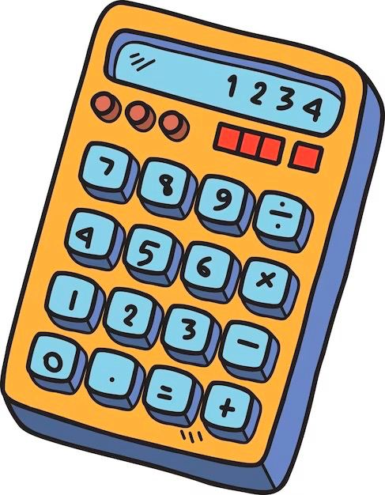
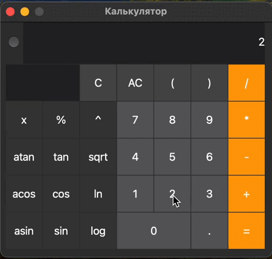
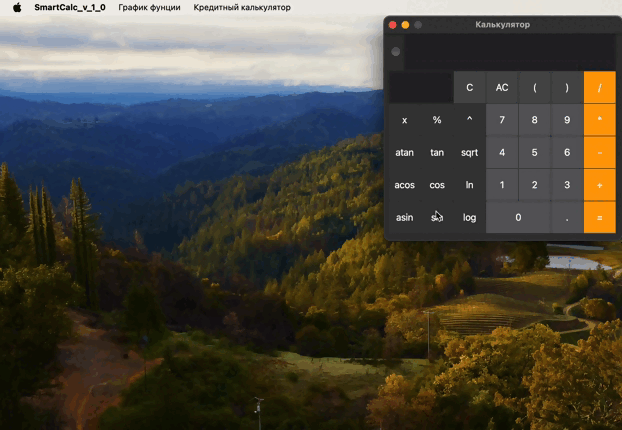
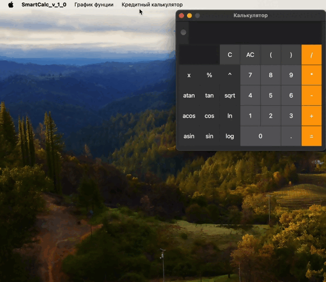

**This project is its own implementation of a scientific calculator using reverse Polish notation (dextra algorithm), as well as with the construction of a graph and a special mode "credit calculator".**

* The program has a graphical user interface, based on the GUI library with API for C++ - "Qt 6.2.3"
* The code is written according to google style
* Both integers and real numbers, written both through a point and in exponential form, can be input into the program
* Verifiable accuracy of the fractional part - at least 7 decimal places
* User can enter up to 255 characters
* The following arithmetic operations and mathematical functions are supported:
  + '()'
  + '+'
  + '-'
  + '*'
  + '/'
  + '^'
  + 'mod'
  + unary '-'
  + cos(x)
  + sin(x)
  + tan(x)
  + acos(x)
  + asin(x)
  + atan(x)
  + sqrt(x)
  + ln(x)
  + log(x)

* Calculation of arbitrary bracket arithmetic expressions in infix notation

* Calculation of arbitrary bracketed arithmetic expressions in infix notation with substitution of the value of the variable 'x' as a number

* Drawing a graph of a function defined by an expression in infix notation with variable x (with coordinate axes, a mark of the scale used, and a grid with adaptive step)

***
  
* Implemented a special mode "credit calculator", which is called by the appropriate button
* Input: total loan amount, term, interest rate, type (annuity, differentiated)
* Output: monthly payment, loan overpayment, total payment

***

This project was developed by a student of School 21: banefort